# Kanban-Obsidian

知乎文字链接：[Obsidan与Kanban：用Quicker快速添加内容到kanban（新版教程）](https://zhuanlan.zhihu.com/p/697755786)

哔哩哔哩视频链接：[Obsidian与kanban：用Quicker快速添加内容到kanban](https://www.bilibili.com/video/BV1sw4m1X7d5/?spm_id_from=333.1387.homepage.video_card.click&vd_source=c08c205650a4a5e13d87475ab1ab2431)

### Obsidan与Kanban：用Quicker快速添加内容到kanban

#### 灵感来源

有时候我们需要将不同笔记的某些内容，包括Markdown和Excalidraw笔记，**快速整合到一个地方，方便整理思路**。而kanban（看板）是一个很好地记录要点的地方，有很好的视觉效果。

但是如果手动复制到kanban，或者在kanban中输入双链，**未免太慢了**。

因此本篇文章讲述的是，**将Markdown笔记中的内容块、Excalidraw中的图形**，一键发送到**指定kanban的指定标题下**。并且是**带链接的，点击后能跳转到原文**，方便回溯。

效果图：

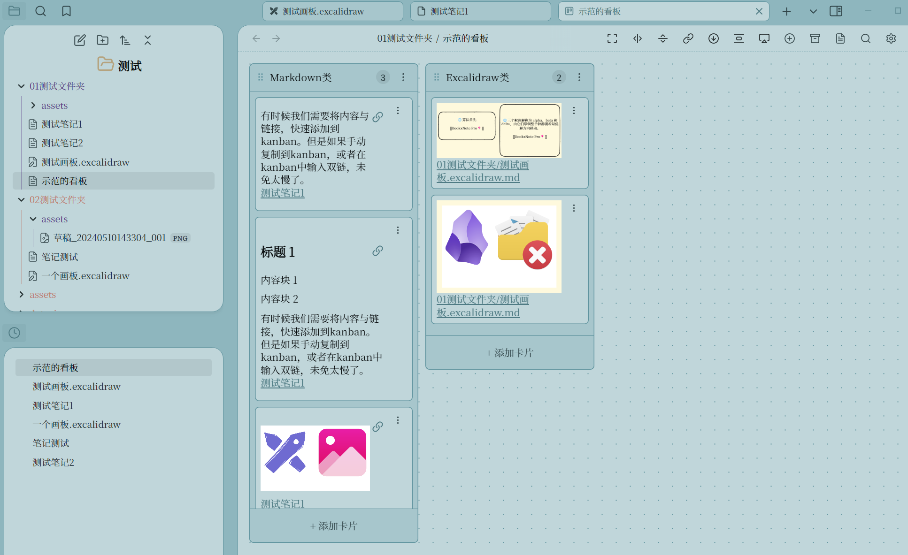

其中的灵感来自B站UP主风尘噗噗啊的视频：[在obsidian中如何使用QuickAdd和Kanban插件来管理日程](https://www.bilibili.com/video/BV1mb4y1y7R6/?spm_id_from=333.880.my_history.page.click&vd_source=c08c205650a4a5e13d87475ab1ab2431)，该视频中提到，设置好QuickAdd动作后，按快捷键可以呼出内容框，填写文字后会自动添加到指定的kanban。该过程中无需打开kanban文件，所以很方便。

我就想着能不能把当前笔记中的内容块，**自动复制为链接**，并且**按照上面的操作自动添加到kanban**中。然后我发现了“Copy Block Link”插件，该插件能**一键复制各种内容块的链接**。

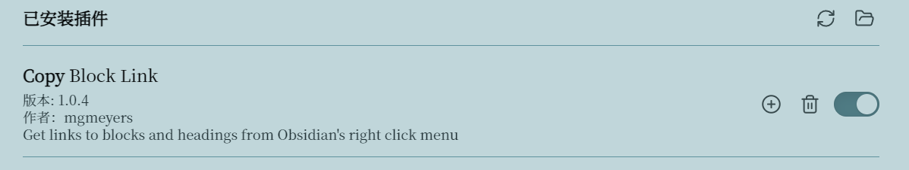

所以大家要安装三个插件，**Copy Block Link**、**Kanban**、**QuickAdd**。

接下来我会分三个部分讲具体的实现步骤。

#### 第一：设置快捷键摘录内容

**Markdown笔记**

Copy Block Link可以一键复制Markdown笔记中的**段落块、标题内容块、图片块等**的链接。但**在Excalidraw中不能使用**。

可以在**设置—快捷键**中，搜索“Copy Block Link”。可以看到有两个快捷键。

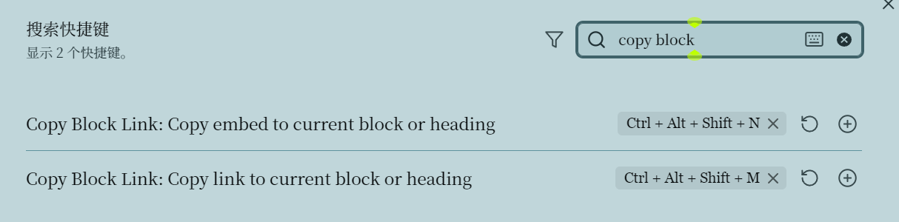

第一个是Copy embed to……，我简称**“嵌入型”**；第二个是Copy link to……，我简称**“链接型”**。

嵌入型能**直接显示链接的内容**，如下图所示，分别是段落、标题内容（会显示该标题之下的内容，遇到同级或上级标题停止）、图片：

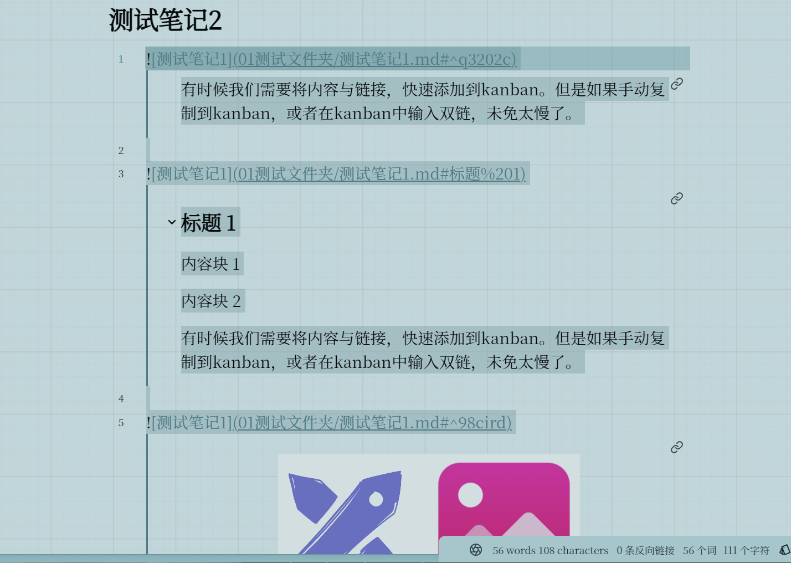

而链接型**只能显示文字**，如下图所示，也是段落、标题内容、图片：

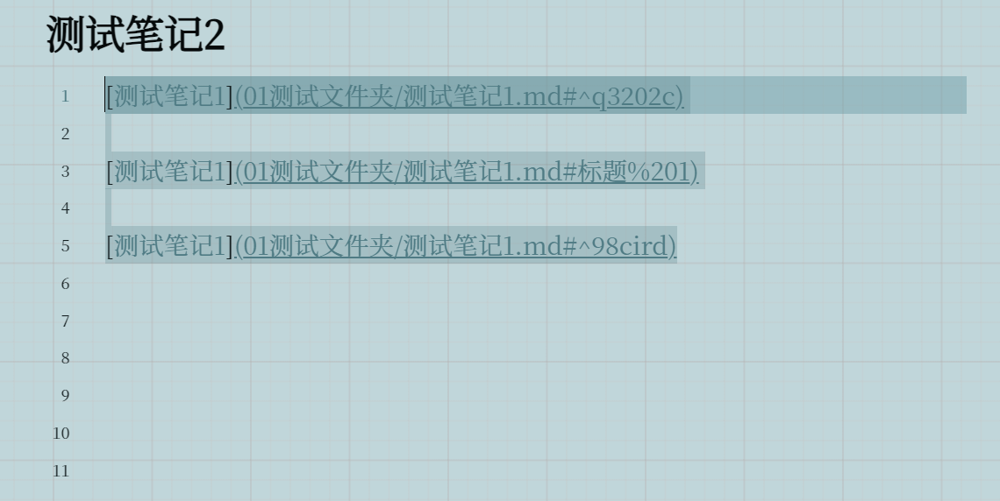

如果仔细对比可以发现，嵌入型比链接型，**只多了一个英文状态的感叹号“!”**。感叹号就是Markdown语法中显示图片的语法。

所以二者本质差不多，大家可以按需选择。

**Excalidraw笔记**

上面说到Copy Block Link插件在Excalidraw中不能使用，但是**Excalidraw官方提供了复制链接的快捷键**。

在**设置—快捷键**中，搜索“链接“，并滑动到最底部，可以看到**最下面有4个关于复制链接的快捷键**：

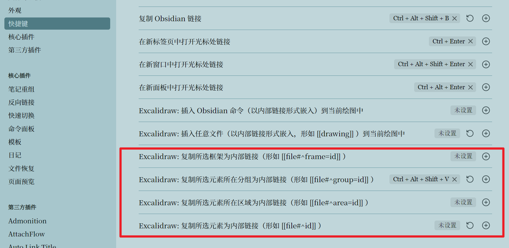

需要说明的是，无论选择哪一个快捷键，**复制链接的时候都会跳出选项框**，让你选择链接类型。其中**选项的顺序是会变的**，第一个选项，就是你按的快捷键对应的链接方式。

大家手动试一下就知道了。**跳出选项框不用管，直接按回车就行**。

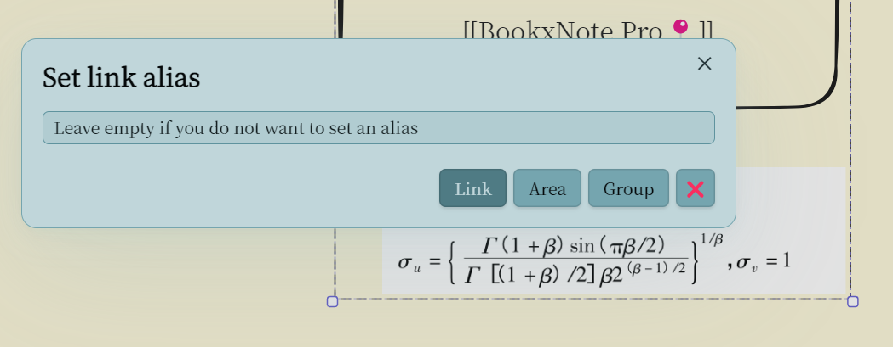

另外，如果**按快捷键没反应**，可以**关闭该Excalidraw文档**，然后重新打开就能复制了。

下面我将用这4种链接方式，**复制下面的Group元素的链接**，方便大家分辨差别：

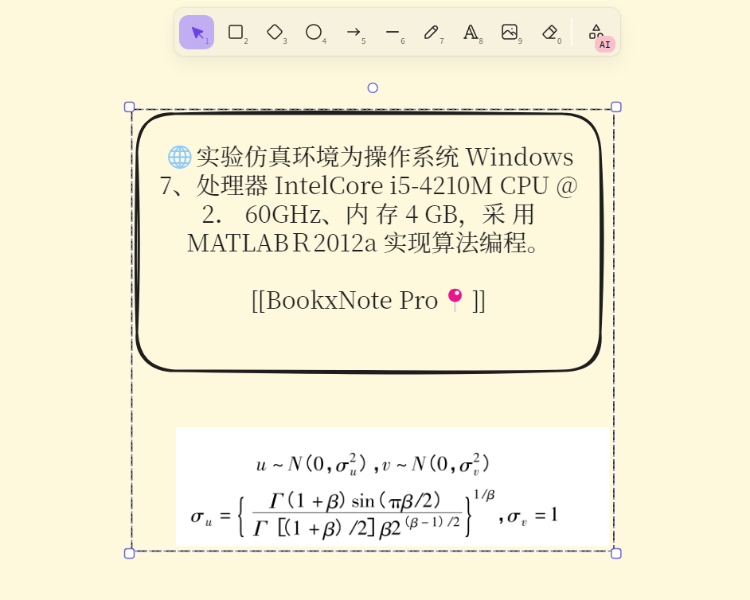

上述4个链接的效果如图：

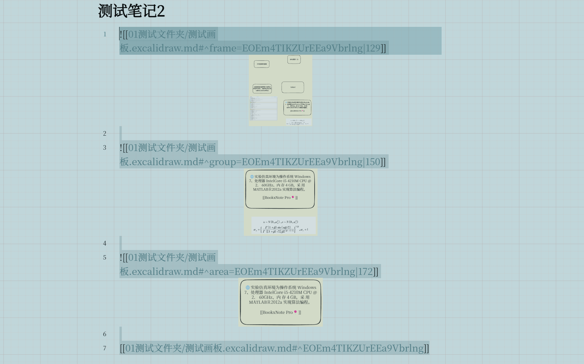

可以发现，第1个会显示全部内容，我一般很少用到。第4个只显示文字链接，也很少用到。注意，它们**不仅相差一个英文感叹号，而且链接也是完全不同的**。

第2个group和第3个area虽然都能显示图片，但是显然**第2种显示的才是正确的**。对于元素的群组（右键选中多个元素后，右键点击Group Selection），**第3中只能显示一个元素框**，不知道是bug还是什么原因。

总之，这4个对于我来说第2个group是最有用的，因此我**设置其快捷键为“Ctrl+Alt+Shift+V”**。可以按自己的需要设置一个不常用的，**防止与其他软件的快捷键冲突**。毕竟使用Quicker来实现，所以也**不需要记住快捷键**。

#### 第二：新建kanban

右键点击导航栏中的一个文件夹，点击**“新看板”**就能新建一个kanban。

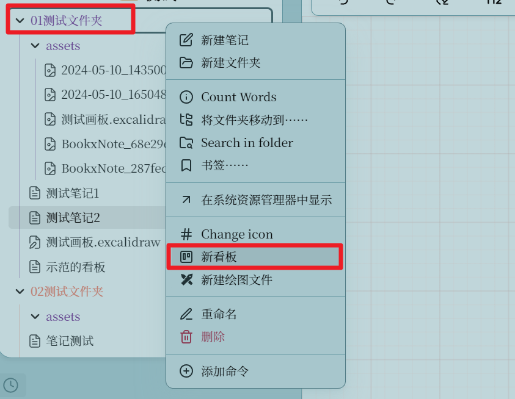

右上角可以**添加列**，输入名称后点击“添加”。

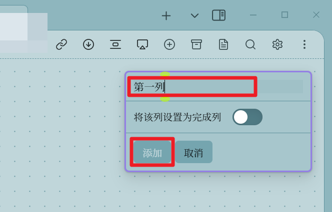

点击**“添加卡片”**，输入内容后按回车，就能添加卡片。

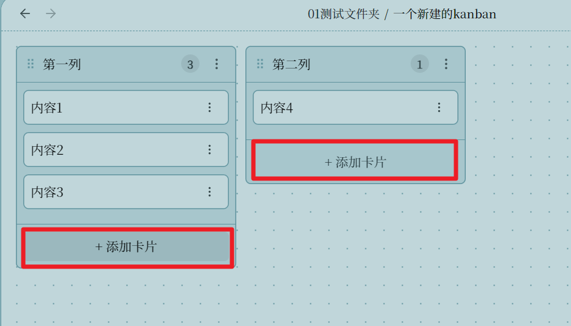

卡片可以拖住**上下移动**，也可以**在不同列中左右移动**：

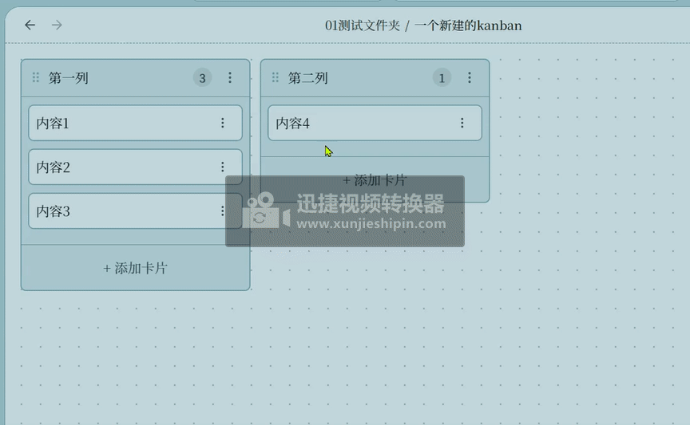

至于kanban的设置，只需要设置一个默认**“列宽”**，自己看得舒服就行，**其他设置不用管**。当然也可以为每一个kanban设置不同列宽。

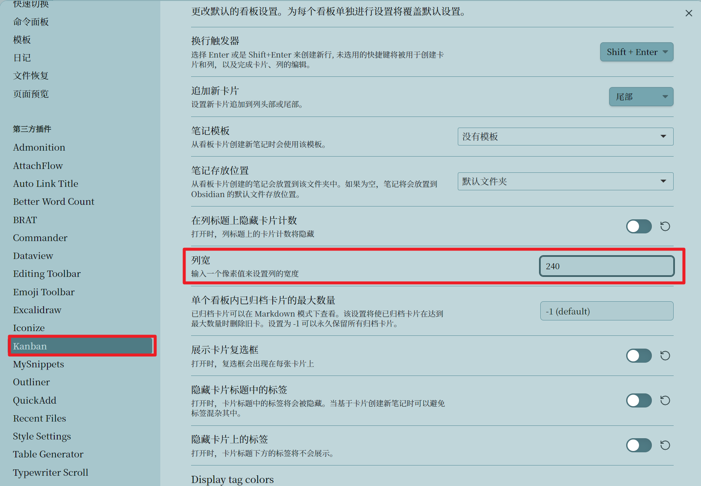

接下来讲一下**kanban的性质**，后面用QuickAdd添加内容会用到。

kanban本质上是Markdown文件，点击右上角的“更多选项”—“打开为Markdown文件”，就可以看到其内容：

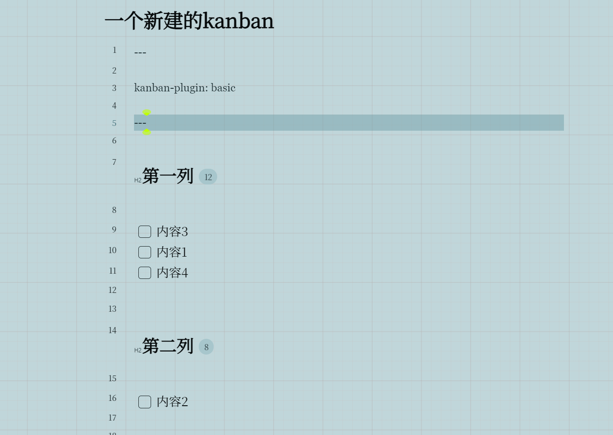

以及：

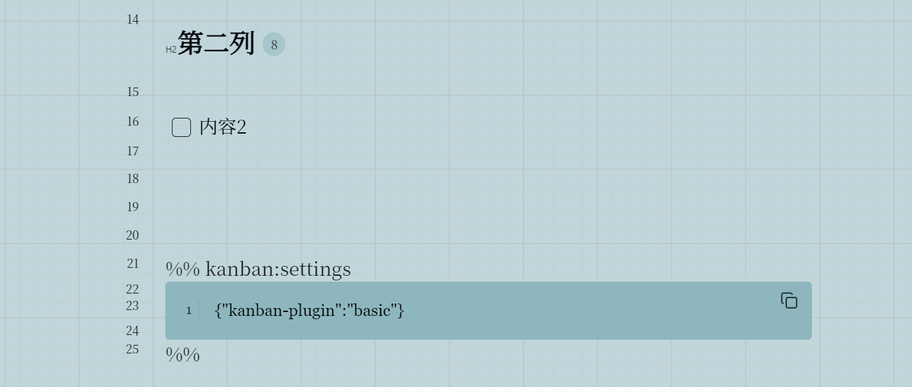

仔细观察其中的**规则**，我们就可以**先在Markdown中输入，然后用kanban显示**。例如我们这里输入第三列的内容：

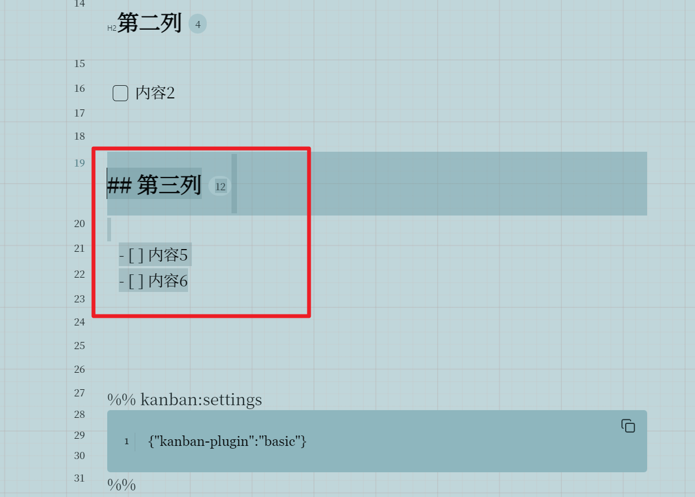

关闭该kanban，然后重新打开，就会发现**已经添加了**：


一定要按规则！一定要按规则！一定要按规则！包括但不限于，**不能修改**开头的`- - -`之间的内容，**也不能修改**末尾的`%%`之间的内容，标题是二级标题，**标题与上下内容之间尽量要有空行**。

#### 第三：用QuickAdd添加内容

用QuickAdd添加内容的灵感，来自B站UP主风尘噗噗啊的视频：[在obsidian中如何使用QuickAdd和Kanban插件来管理日程](https://www.bilibili.com/video/BV1mb4y1y7R6/?spm_id_from=333.880.my_history.page.click&vd_source=c08c205650a4a5e13d87475ab1ab2431)。

打开QuickAdd设置面板，选择类型为“Capture”，输入该动作的名称，点击“Add Choice”添加：

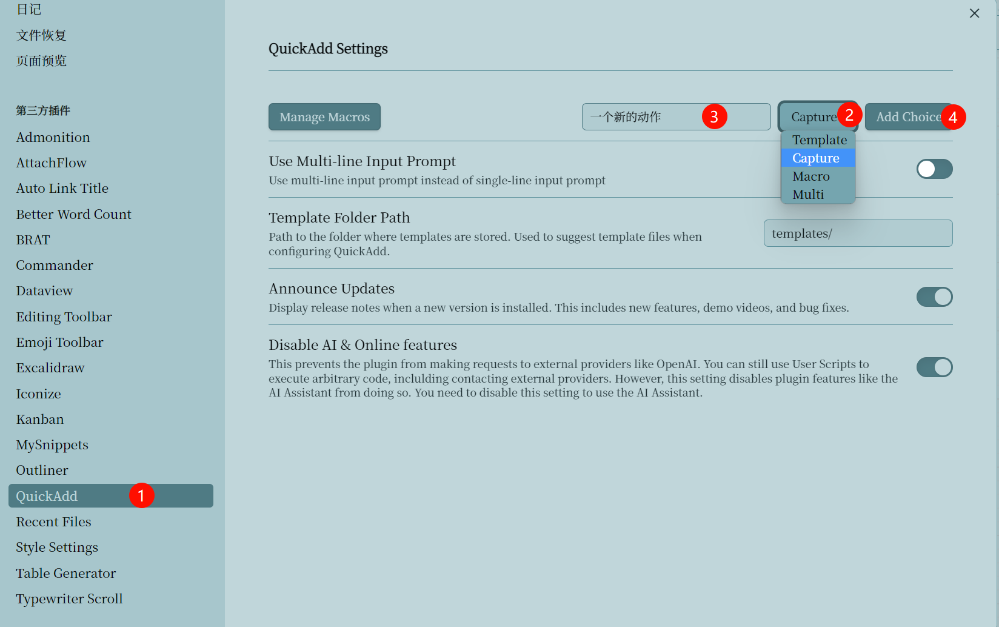

点击齿轮按钮进行设置，你想添加的kanban名称是什么，直接输入名称，在跳出的文件中选择：

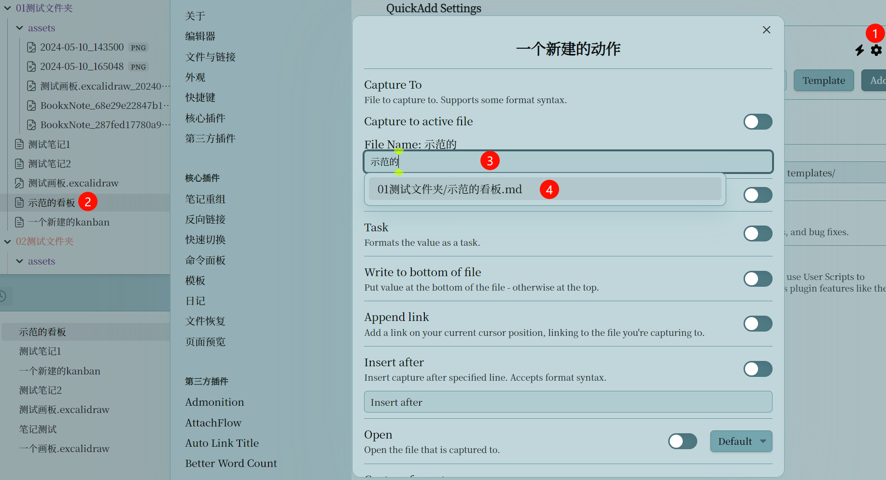

选上“Insert after”，表示嵌入什么内容之后；我们之前说过，kanban就是Markdown文件，标题是二级标题，所以**这里输入列的二级标题即可，如下下图所示**（注意中间有空格）；

选上“Insert at end of section”，表示嵌入到该章节的末尾。也就是**添加卡片到列的末尾**，遵循先来后到的原则。

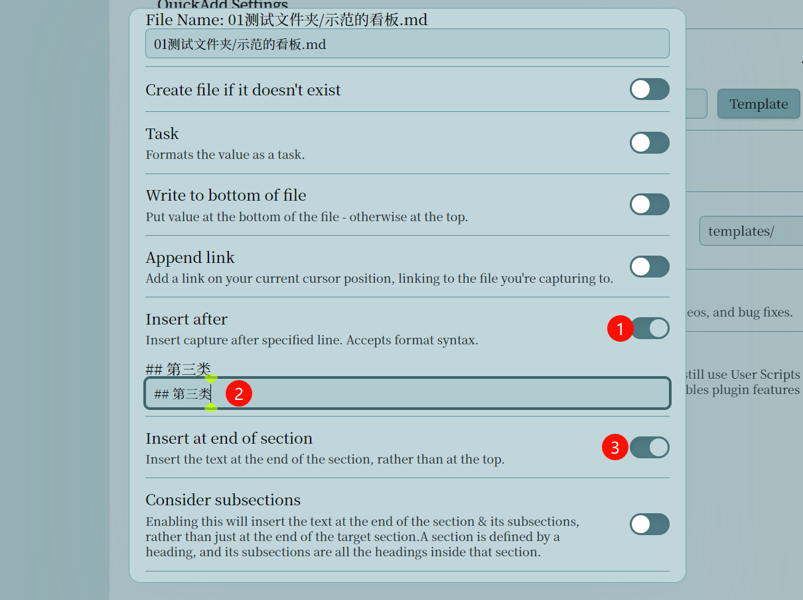

上述标题就是列的名称：

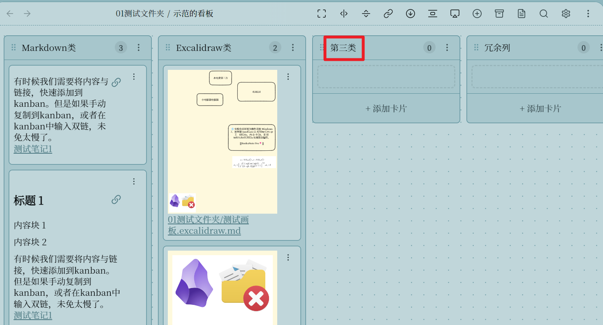

最后是**最重要的两点**，直接关系到成功与否。

点击“Capture format”，自定义捕获格式。按照我们之前关于kanban的了解，其中的卡片实际上，**就是Markdown中的任务列表**。

因此这里输入的是任务列表的语法。而`{{VALUE:这是输入框的提示内容}}`中的VALUE表示**任务列表的内容**，也可以说是输入框中内容（*输入框后面会讲到*）；英文冒号`:`后的内容，表示输入框的提示内容。

只要输入两个英文的大括号`{{`，就会自**动跳出选项来**，可以选择。

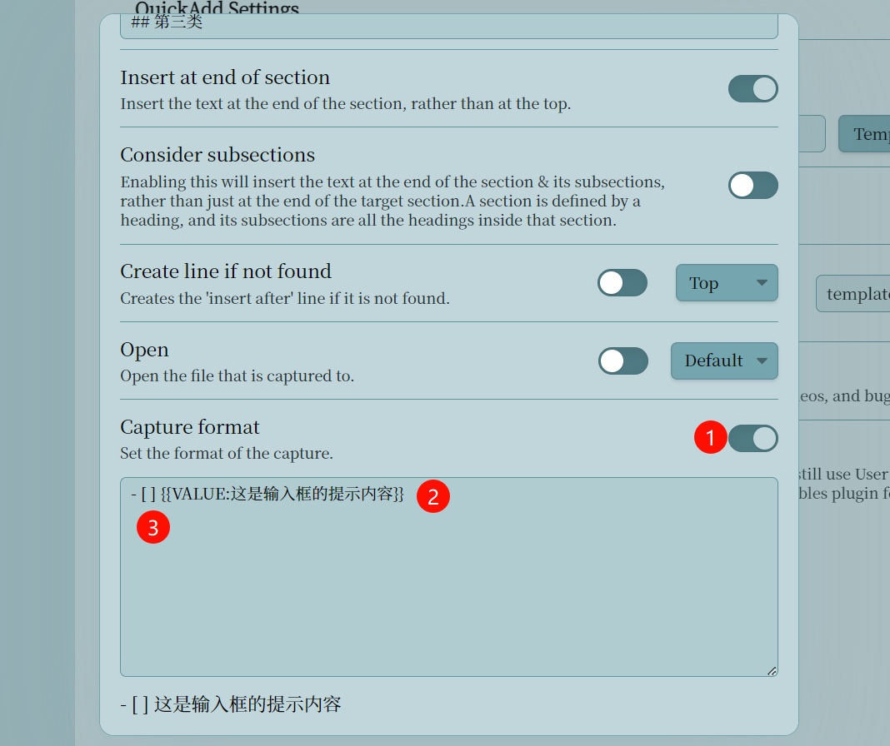

上图中的“3”表面上看没什么内容，**但是实际上是回车操作**。因为我之前讲到kanban的末尾的`%%`之间的内容是不能修改的，否则会出错。

如果不添加回车操作空出一行，就会**添加内容到`%%`的后面**，**导致出错**。如图所示：

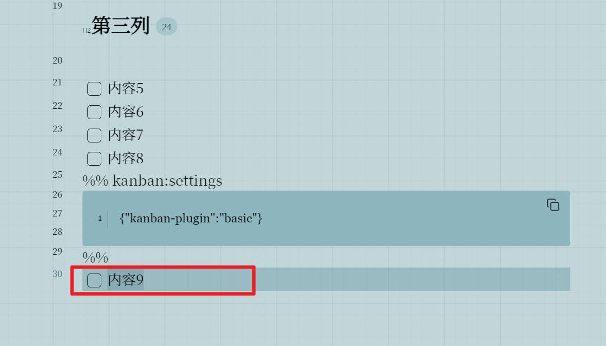

所以这里的回车就起到，**补偿出自己所占用的一行空间**。以下是代码，大家可以直接复制黏贴：

~~~
- [ ] {{VALUE:}}

~~~

第二个重点是，kanban中**必须在最后多放一个冗余的列**。你可以在该列中手动添加内容，但是绝对不要用QuickAdd该列添加内容。


这是因为QuickAdd会默认，末尾`%%`之间的内容属于最后的标题，所以会**直接把内容添加到`%%`末尾，导致识别不了**。

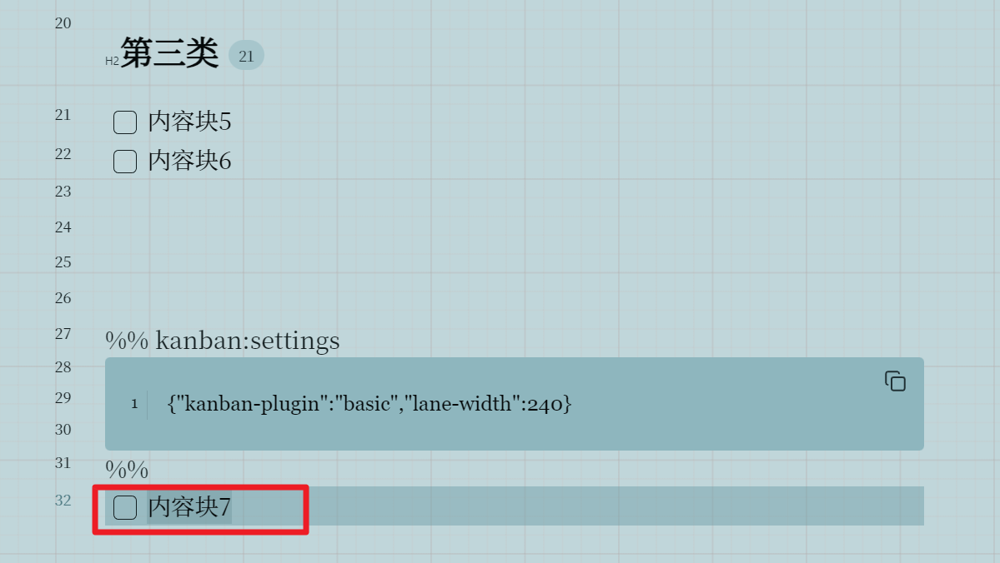

如果有一个冗余列的话就不会添加到最后面，**相当于阻隔的作用，限制添加内容的位置**。

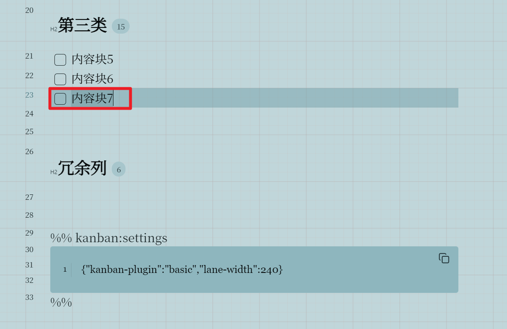

基本就设置完了，接下来我们点击动作右边的**闪电图标**，使其变为金色。这样能把**该动作添加到了命令中，方便设置快捷键**。

在“设置”—“快捷键中”搜索该动作的名称，然后为其设置快捷键。同样设置一个不常用的，**防止与其他软件的快捷键冲突**。毕竟使用Quicker来实现，所以也**不需要记住快捷键**。


接下来测试一下QuickAdd的动作有没有问题。**按上图设置的快捷键**，Ctrl+Alt+Shift+Q（按照自己的），会出现一个输入框。

上面的这一段“这是输入框的提示内容”文字，就是上面讲到的，**输入框的提示内容**。框中需要输入的内容，**就是待办列表后面的内容**。我这里输入“哈哈哈哈1234”，**然后点击“Ok”或按回车**。

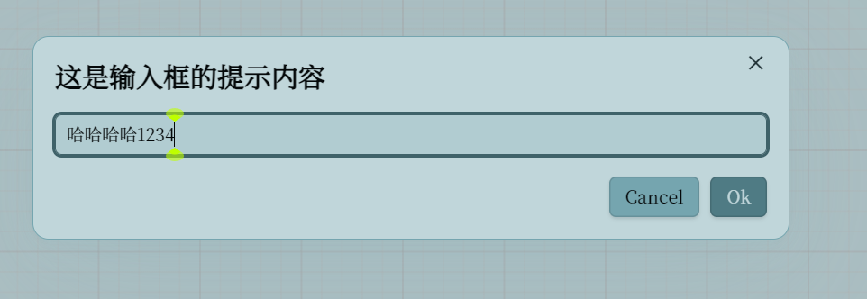

如果在kanban中出现了对应的卡片，**说明设置成功了！！！**

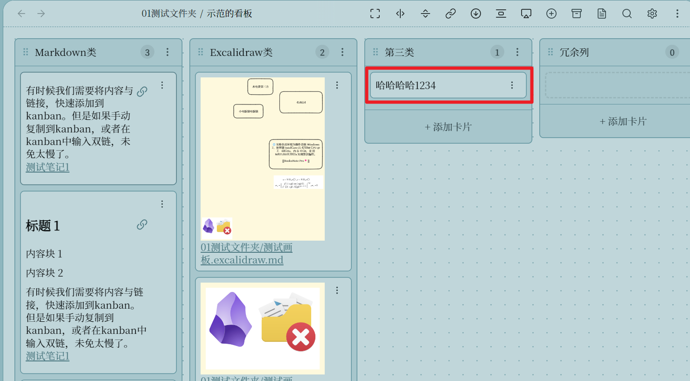

#### 用Quicker软件串联一系列操作

Quicker动作的思路：

1. 自动按快捷键，复制Markdown笔记（Excalidraw笔记）中的链接；
2. 处理链接；
3. 自动按快捷键，调用QuickAdd的Capture动作，跳出内容框；
4. 自动按ctrl+v黏贴；
5. 自动按Enter回车关闭内容框。

下面介绍一下Quicker动作的每一步详情。

Markdown中：

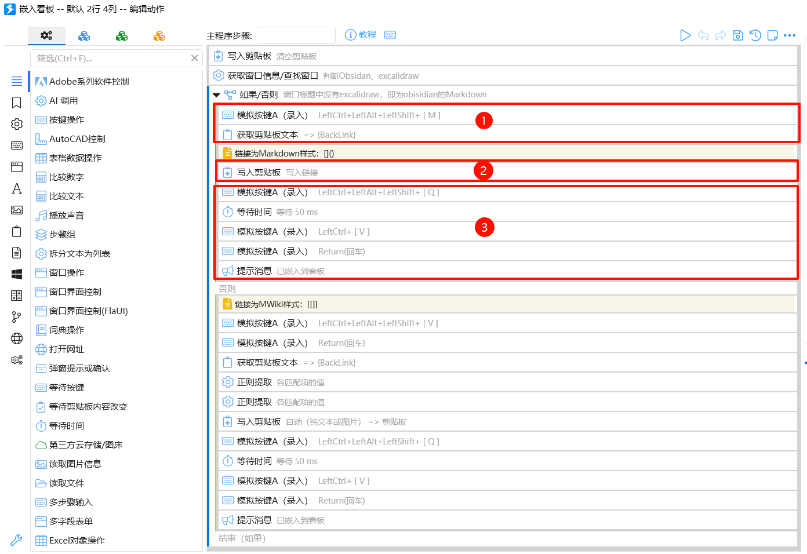

第1：快捷键获取链接，嵌入型比链接型，只多了一个英文状态的感叹号“!”。所以我这里只复制链接型，例如：

`[测试笔记1](01测试文件夹/测试笔记1.md#^mdb5pv)`

第2：处理链接，并复制到剪贴板。处理结果为：

```

[测试笔记1](01测试文件夹/测试笔记1.md#^mdb5pv)
```

之所以是这样的双层链接，是为了**既能看到原文，又能点击链接跳转**，效果如下图所示：


第3：按QuickAdd动作的快捷键，会跳出输入框。按Ctrl+V复制，按回车关闭输入框，就完成了。

演示：


Excalidraw中：

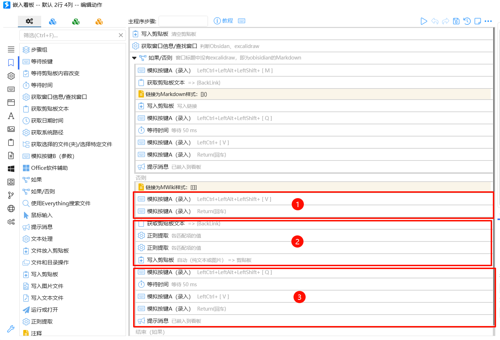

第1：按Excalidraw中的快捷键，复制第2个group链接（不记得可回看上面的内容）。因为会跳出选项框，所以需要按回车关闭选项框。

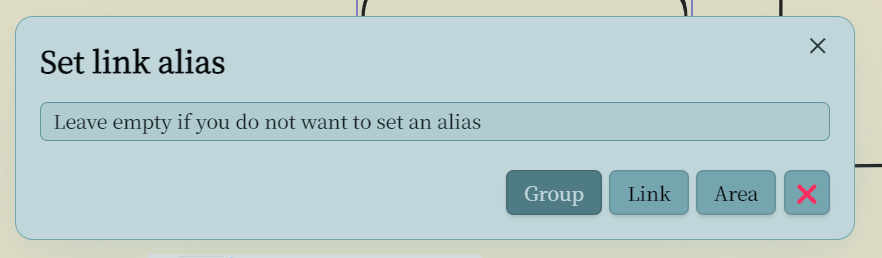

链接样式：

`![[01测试文件夹/测试画板.excalidraw.md#^group=UKojafTz]]`

第2：处理链接，并复制到剪贴板。处理结果为：

~~~
![[01测试文件夹/测试画板.excalidraw.md#^group=UKojafTz]]
[01测试文件夹/测试画板.excalidraw.md](01测试文件夹/测试画板.excalidraw.md#^group=UKojafTz)
~~~

之所以是这样的双层链接，同样是为了**既能看到原文，又能点击链接跳转**，效果如下图所示：


第3：按QuickAdd动作的快捷键，会跳出输入框。按Ctrl+V复制，按回车关闭输入框，就完成了。

演示：


#### 总结

这篇文章中主要讲用Quicker，一键将内容发送到指定kanban的指定列。

那么如果需要添加内容到同一个kanban的其他列怎么办？**要么修改QuickAdd动作中的嵌入标题**，如下图所示；**要么重新添加一个QuickAdd动作**，同时重新设置快捷键。注意上面说到的两个重点。

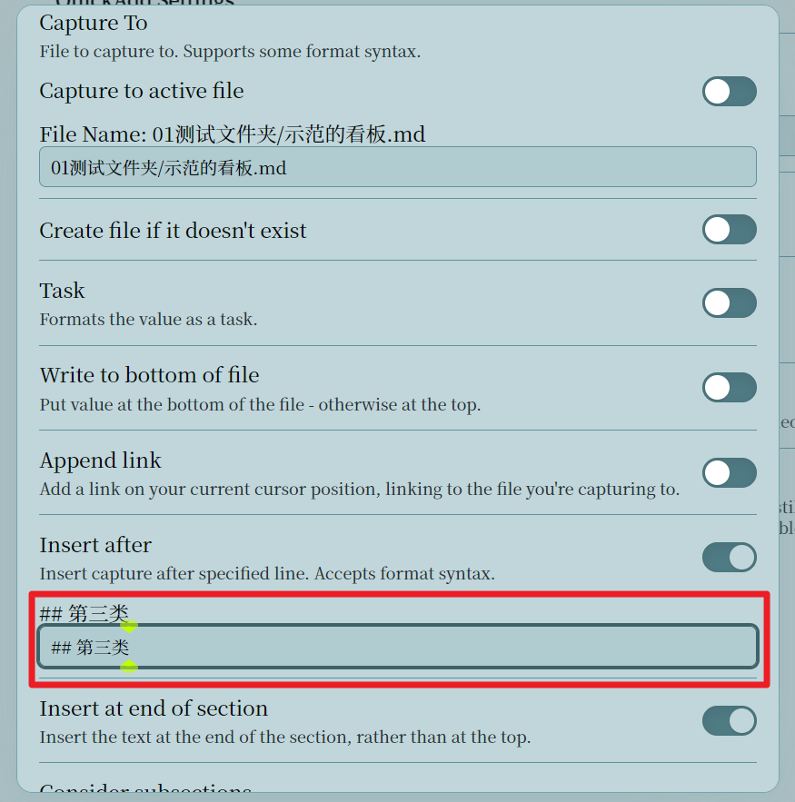

同样如果需要添加内容到别的kanban怎么办？**要么修改QuickAdd动作中的文档和标题**，如下图所示；**要么重新添加一个QuickAdd动作**，同时重新设置快捷键。同样注意上面说到的两个重点。

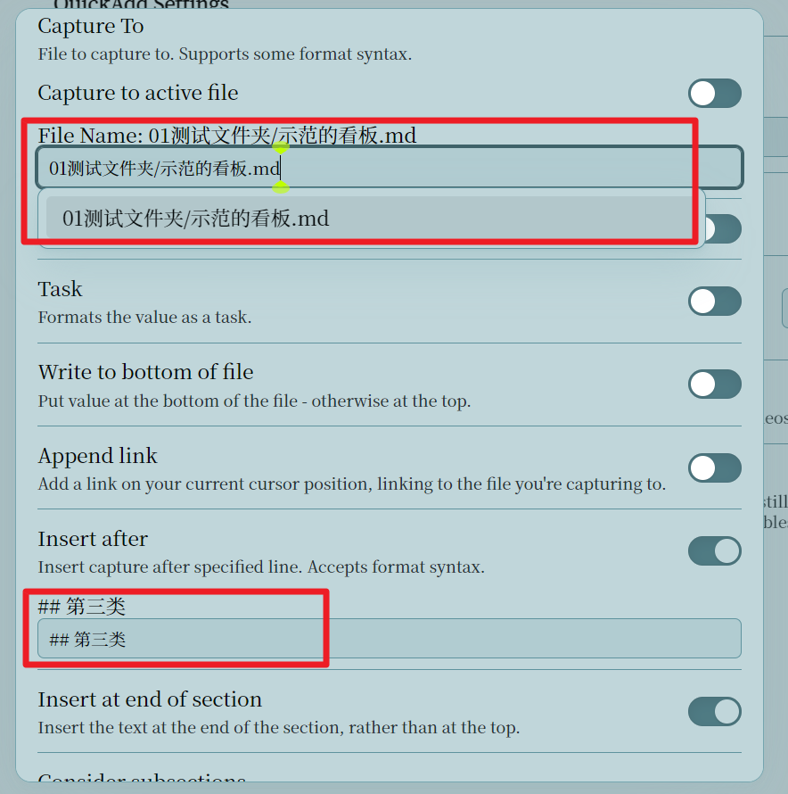

如果大家看了前几篇关于回链、各种软件与Obsidian联动的文章，那么**完全可以自己将BookxNote、Zotero、PotPlayer、哔哩哔哩、Office、Eagle、Xmind等软件的内容，一键添加到Obsidian的kanban中**，原理和这篇文章的内容差不多。

**以后有兴趣、有时间再分享各种技巧吧**，目前关于能想到了都写了文章都全部写完了，大家可以去主页找。近期应该不会再更新内容了。

我将Quicker动作、不同的摘录情况的调试运行详情放到了[github仓库](https://github.com/operations4304/Kanban-Obsidian)

大家可能需要按照上面的介绍，修改为自己设置的快捷键才能用。

谢谢观看！


